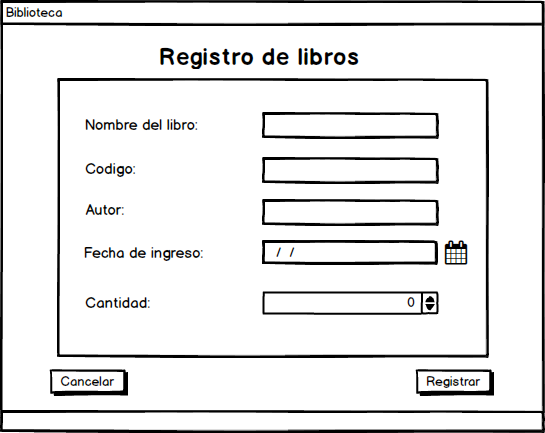
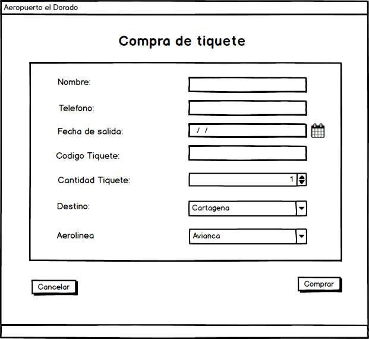
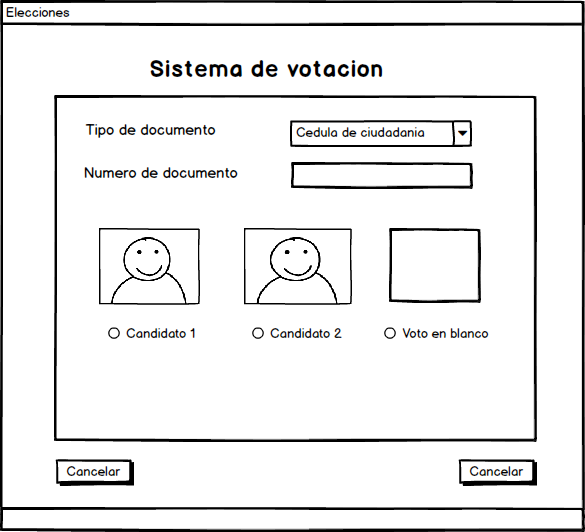

# introducion

Una parte fundamental en todo software es
la interfaz de usuario, quien es la encargada
de interactuar el software con el usuario. Se
requiere entonces diseñar interfaces de acuerdo
a los requerimientos del sistema pero siempre
teniendo en cuenta a los usuarios. “Como dice el
dicho, todo entra por los ojos”. Por lo anterior es
importante que las interfaces sean funcionales,
pero teniendo en cuenta los detalles de diseño y
los atributos de usabilidad.

1. Objetivos
OBJETIVO GENERAL:
Diseñar interfaces de usuario utilizando las herramientas Balsamiq Mockups y
Gomockingbird.
OBJETIVOS ESPECÍFICOS:
• Identificar los pasos a seguir para la construcción del
diseño de la interfaz de usuario.
• Hacer el diseño en la herramienta Balsamiq Mockups o
Gomockingbird.
• Identificar los datos de entrada y salida que se utilizan en
el diseño de la interfaz.
• Aplicar las estructuras de programación de acuerdo con la
situación presentada.

Para el desarrollo de cada uno de los ejercicios tener en cuenta el
siguiente procedimiento:
3.1. Pasos
Se recomienda seguir activamente las siguientes instrucciones:
1. Leer detenidamente el enunciado de la actividad, donde le quede claro qué es lo que
se está solicitando.
2. Identificar los datos de entrada y salida que son necesarios en el diseño de la interfaz,
investigar con otras fuentes de ser necesario.
3. Identificar el elemento gráfico que sirve para la captura de cada uno de los datos.
4. Hacer el diseño en la herramienta Balsamiq Mockups o Gomockingbird.
5. Utilizar en el diseño los objetos de acuerdo al prototipo que realizó.
6. Exportar los archivos a formato JPG o PNG al documento .doc.
7. Guardar el archivo en una carpeta para ser enviado al Tutor.

Realizar los siguientes ejercicios:

PRIMER ENUNCIADO: diseñar la interfaz de usuario para la captura de los datos de un
libro que debe ser registrado en la biblioteca.

SEGUNDO ENUNCIADO: diseñar la interfaz de usuario para la captura de los datos del
registro de una persona en un hotel.

TERCER ENUNCIADO: diseñar la interfaz de usuario para la captura de datos cuando
una persona compra un tiquete para un vuelo nacional.

CUARTO ENUNCIADO: diseñar una interfaz de usuario para un sistema de votación que
incluye tres (3) candidatos, uno de ellos corresponde al voto en blanco.

