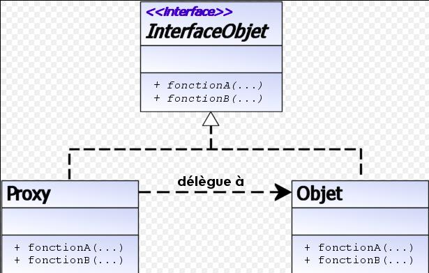

## PROXY (patrón de diseño)

El patrón Proxy es un patrón estructural que tiene como propósito proporcionar un subrogado o intermediario de un objeto para controlar su acceso. 

Un proxy, en su forma más general, es una clase que funciona como una interfaz para otra cosa. El proxy podría interactuar con cualquier cosa: una conexión de red, un objeto grande en la memoria, un archivo o algún otro recurso que sea costoso o imposible de duplicar. En resumen, un proxy es un contenedor o un objeto de agente que el cliente está llamando para acceder al objeto de servicio real detrás de escena. El uso del proxy puede ser simplemente reenvío al objeto real, o puede proporcionar lógica adicional. En el proxy, se puede proporcionar una funcionalidad adicional, por ejemplo, el almacenamiento en caché cuando las operaciones en el objeto real requieren muchos recursos, o la comprobación de las condiciones previas antes de que se invoquen las operaciones en el objeto real. Para el cliente, el uso de un objeto proxy es similar al uso del objeto real, porque ambos implementan la misma interfaz

### Motivación :

Para explicar la motivación del uso de este patrón veamos un escenario donde su aplicación sería la solución más adecuada al problema planteado. Consideremos un editor que puede incluir objetos gráficos dentro de un documento. Se requiere que la apertura de un documento sea rápida, mientras que la creación de algunos objetos (imágenes de gran tamaño) es costosa. En este caso no es necesario crear todos los objetos con imágenes nada más abrir el documento porque no todos los objetos son visibles. Interesa por tanto retrasar el coste de crear e inicializar un objeto hasta que es realmente necesario (por ejemplo, no abrir las imágenes de un documento hasta que no son visibles). La solución que se plantea para ello es la de cargar las imágenes bajo demanda. Pero, ¿cómo cargar las imágenes bajo demanda sin complicar el resto del editor? La respuesta es utilizar un objeto proxy. Dicho objeto se comporta como una imagen normal y es el responsable de cargar la imagen bajo demanda. 

### Aplicabilidad :

El patrón proxy se usa cuando se necesita una referencia a un objeto más flexible o sofisticada que un puntero. Dependiendo de la función que se desea realizar con dicha referencia podemos distinguir diferentes tipos de proxies:
*  proxy remoto: representante local de un objeto remoto.
*   proxy virtual: crea objetos costosos bajo demanda (como la clase ImagenProxy en el ejemplo de motivación).
  *  proxy de protección: controla el acceso al objeto original (ejemplo de *proxy de protección: [1])
    proxy de referencia inteligente: sustituto de un puntero que lleva a cabo operaciones adicionales cuando se accede a un objeto (ej. contar número de referencias al objeto real, cargar un objeto persistente bajo demanda en memoria, control
    deaconcurrencia de acceso tal como 
loquear el objeto para impedir acceso concurrente.

### Participantes :

La clase Proxy : mantiene una referencia al objeto real (en el siguiente ejemplo se le denomina _sujetoReal) y proporciona una interfaz idéntica al sujeto (la clase Sujeto). Además controla el acceso a dicho objeto real y puede ser el responsable de su creación y borrado. También tiene otras responsabilidades que dependen del tipo de proxy:

* proxy remoto: responsable de codificar una petición y sus argumentos, y de enviarla al objeto remoto.

* proxy virtual: puede hacer caché de información del objeto real para diferir en lo posible el acceso a este.

* proxy de protección: comprueba que el cliente tiene los permisos necesarios para realizar la petición.

### La clase Sujeto:
  define una interfaz común para el proxy (Proxy) y el objeto real (de la clase SujetoReal), de tal modo que se puedan usar de manera indistinta.

### La clase Sujeto real :
 clase del objeto real que el proxy representa.

 ### Ejemplos de funcionamiento:

  * Diagrama de clases para un ejemplo de patron proxy.
  
  * Diagrama de secuencia para un ejemplo en el que no se utiliza el patrón proxy. 
  * Diagrama de secuencia para un ejemplo en el que se utiliza el patrón proxy.

  ### Consecuencias

  El uso de un proxy introduce un nivel de indirección adicional con diferentes usos:

   * Un proxy remoto oculta el hecho de que un objeto reside en otro espacio de direcciones.
   * Un proxy virtual puede realizar optimizaciones, como la creación de objetos bajo demanda.
   * El proxy de protección y las referencias inteligentes permiten realizar diversas tareas de mantenimiento adicionales al acceder a un objeto.

Además, su uso también permite realizar una optimización COW (copy-on-write) , puesto que copiar un objeto grande puede ser costoso, y si la copia no se modifica, no es necesario incurrir en dicho gasto. Además el sujeto mantiene un número de referencias, y solo cuando se realiza una operación que modifica el objeto, este se copia. Es útil por tanto para retrasar la replicación de un objeto hasta que cambia. 